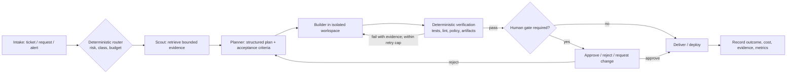

# Forget Loop Engineering — AI Developer Workflows

**Source:** [IndyDevDan — “FORGET Loop Engineering. Agentic Engineering is about THIS”](https://youtu.be/VQy50fuxI34) (34:19)  
**Raw transcript:** `C:/Users/Kyle/OneDrive/Documents/Obsidian Vault/70-Raw/YouTube/2026/07/2026-07-13-VQy50fuxI34-forget-loop-engineering-transcript.md`

## Why this changes our model

We were treating *loop engineering* as the organizing concept: agent produces work, validator fails, agent patches until pass. That is useful but too narrow. It describes **one control-flow pattern inside a larger system**.

The real unit to design is an **AI developer workflow (ADW)**: an end-to-end, observable pipeline that combines three actors:

1. **Engineer** — sets intent, designs the workflow, handles risk-bearing approvals, improves the factory.
2. **Agents** — perform bounded reasoning/work steps with specialized context.
3. **Deterministic code** — routes state, creates isolation, runs tests, evaluates gates, moves tickets, and records evidence.

The goal is not “more loops” or “more agents.” It is a **software factory**: reusable workflows that route a class of work through the right agents, code gates, cost envelope, sandbox, and human review.

## Core claims from the video

| Claim | Evidence / implication |
|---|---|
| A loop is a component, not the architecture. | A lint/test failure returning to a build agent is one feedback edge inside plan → build → test → review → ship. |
| Code should own deterministic work. | Routing, state transitions, formatting, type checks, tests, CI gates, artifact collection, and retries should not consume agent tokens. |
| Humans belong primarily at the boundaries. | Human effort compounds most when it designs the workflow at intake and validates high-risk results at exit—not when it babysits every node. |
| Agents should be specialized and isolated. | Scout, planner, builder, tester, reviewer, and hotfix roles should have small contexts and clear contracts; sandbox/worktree isolation enables parallelism. |
| Workflow selection should be risk/cost-aware. | A chore may use one workhorse agent plus CI; a production incident may use a specialized hotfix workflow, approval gate, and parallel sandboxes racing toward a fix. |
| Start simple, then extract. | Walk the task manually first, draw the nodes and information flow, then automate a small workflow. Do not begin with a giant all-in-one skill. |

## What we adopt

| Decision | Verdict | Practical meaning for RaapTech / Hermes |
|---|---|---|
| **ADW is the umbrella term.** | Adopt | Stop describing the operating model as “loop engineering.” Use *AI developer workflow* / *workflow factory*. |
| **Loop = a bounded repair mechanism.** | Adopt | Retain write → validate → patch-until-pass, but only inside a named workflow and behind explicit stop conditions. |
| **Code orchestrates determinism.** | Adopt | Cron, scripts, ticket transitions, test execution, evidence storage, retry limits, routing, and delivery live in code/config—not prompts. |
| **Specialist roles with contracts.** | Adopt | Define scout → planner → builder → verifier → human/ship contracts; do not use one mega-agent for every production task. |
| **Risk-tiered workflow routing.** | Adopt | Chore, feature, bug, hotfix, research, and customer-facing automation each need different models, gates, autonomy, and budgets. |
| **Human review is calibrated, not removed by slogan.** | Adopt cautiously | Keep human approvals for financial actions, production deploys, customer communications, destructive changes, and novel/high-uncertainty work. Autonomy must be earned with measured reliability. |
| **“Never touch the app layer.”** | Reject literally | Good meta-work is leverage, but direct engineering and customer/domain judgment remain necessary. The correct goal is to reduce repetitive app-layer toil, not prohibit it. |

## Where our previous approach was weak

- We documented the **repair loop**, but not the **workflow boundary**, state machine, artifacts, ownership, routing criteria, cost budget, or escalation path.
- We let the model/skill often own sequencing that should be deterministic code. That makes retries opaque and difficult to test.
- “Use a subagent” was treated as an action, not a formal workflow with input contract, isolated workspace, acceptance checks, output schema, and stop condition.
- We have individual tools (Hermes cron, skills, subagents, TradingView, scripts) but not a unified workflow catalog that tells us *which route handles which work class*.

## Target operating model

The **loop** is only `V → B`. The workflow includes everything from intake to outcome and learning.

## Initial workflow catalog to build

| Workflow | Trigger | Autonomous scope | Mandatory gates | Human gate |
|---|---|---|---|---|
| Research brief | Question / URL / feed event | retrieve → synthesize → source-note draft | citations, source-quality check, explicit gaps | before durable decision / publish |
| Repo change — chore | Small, low-risk ticket | scout → build → test | lint, unit tests, diff scope | before merge initially |
| Repo change — feature | Defined feature ticket | scout → plan → build → verify | plan acceptance, tests, UI/API evidence | approve plan + merge |
| Production hotfix | Incident alert | scout → parallel fix candidates → verify | incident runbook, targeted regression, rollback | mandatory deploy approval |
| Ops watchdog | Scheduled health check | collect → threshold → notify | deterministic probe, dedupe, delivery verification | only on remediation |

## Concrete next moves

1. Rename the RaapTech Brain doctrine from **loop engineering** to **AI developer workflows / workflow factory**; preserve loops as verification-repair subroutines.
2. Create a versioned workflow contract template: trigger, input schema, allowed tools, environment/isolation, actors, deterministic gates, retry budget, output schema, evidence, escalation, and owner.
3. Build **one** real reference workflow end-to-end first: `repo chore → isolated agent → test gate → human merge`. Instrument duration, tokens/cost, pass rate, rework rate, and failure type.
4. Make deterministic code the source of truth for workflow transitions and retry ceilings. Prompts/skills provide role expertise; they do not silently control production state.
5. Add a separate production-hotfix workflow only after the low-risk reference workflow has reliable measurements.

## Source limits

This note is a synthesis of the creator’s operating model, not proof that every claim is universally correct. Assertions about future hardware/agent adoption are forecasts. The adopted decisions above are ours and should be validated through measured workflow runs.